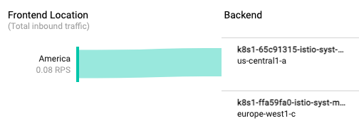
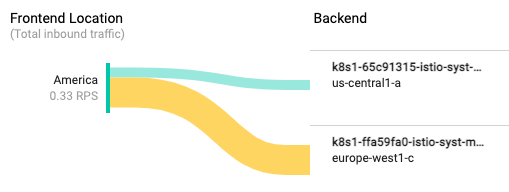
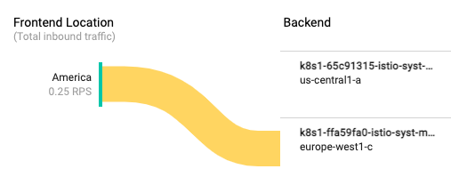
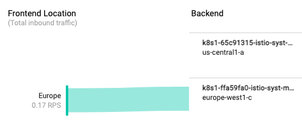

# Multicluster Ingress with ASM


**Multicluster Ingress** sets up a Global Loadbalancer that sends incoming traffic to the nearest cluster. Multicluster Ingress depends on another concept called **Multicluster Service** that stands up a headless kubernetes service for your application on each cluster. This headless kubernetes service has your application pods as endpoints. Each of these headless kubernetes services are set up as Network Endpoint Groups (NEGs) for the Global Loadbalancer's backend service. The traffic reaching the GLB will be sent to the nearest NED hence reaching your application pod.

In this demo we will set up two GKE clusters in different regions `us-central1-a` and `europe-west-1c`. We will create a MultiCluster Ingress and a MultiCluster Service that frontends an application to test
* traffic flow to the nearest cluster
* traffic failover to the other cluster when the application fails on the nearest cluster

## Prerequisites

* gcloud CLI

## Create two GKE Clusters in different regions

* Create a new project, if required  Set corresponding project id

```
PROJECT_ID=<<yourgcpproject>>
gcloud config set project ${PROJECT_ID}
```

* Enable required services in the project

```
gcloud services enable gkehub.googleapis.com
gcloud services enable anthos.googleapis.com
gcloud services enable multiclusteringress.googleapis.com
```

* Create `gke-us` in `us-central1-a` zone with Workload Identity enabled and IP Alias enabled

```
gcloud container clusters create gke-us --zone us-central1-a \
    --machine-type "e2-standard-4" --disk-size "100" \
    --scopes "https://www.googleapis.com/auth/compute",\
"https://www.googleapis.com/auth/devstorage.read_only",\
"https://www.googleapis.com/auth/logging.write",\
"https://www.googleapis.com/auth/monitoring",\
"https://www.googleapis.com/auth/servicecontrol",\
"https://www.googleapis.com/auth/service.management.readonly",\
"https://www.googleapis.com/auth/trace.append" \
    --num-nodes "4" \
    --release-channel stable --enable-ip-alias \
    --workload-pool=${PROJECT_ID}.svc.id.goog \
    --async
```
* Create `gke-eu` in `europe-west1-c` zone with Workload Identity enabled and IP Alias enabled

```
gcloud container clusters create gke-eu --zone europe-west1-c \
    --machine-type "e2-standard-4" --disk-size "100" \
    --scopes "https://www.googleapis.com/auth/compute",\
"https://www.googleapis.com/auth/devstorage.read_only",\
"https://www.googleapis.com/auth/logging.write",\
"https://www.googleapis.com/auth/monitoring",\
"https://www.googleapis.com/auth/servicecontrol",\
"https://www.googleapis.com/auth/service.management.readonly",\
"https://www.googleapis.com/auth/trace.append" \
    --num-nodes "4" \
    --release-channel stable --enable-ip-alias \
    --workload-pool=${PROJECT_ID}.svc.id.goog \
    --async
```

* Wait a few minutes until both the clusters are up and running and verify

```
gcloud container clusters list
```
Output similar to

```
NAME    LOCATION        MASTER_VERSION    MASTER_IP     MACHINE_TYPE   NODE_VERSION      NUM_NODES  
STATUS
gke-eu  europe-west1-c  1.18.17-gke.100   34.77.151.52  e2-standard-4  1.18.17-gke.100   4          
RUNNING
gke-us  us-central1-a   1.17.17-gke.3700  34.69.30.249  e2-standard-4  1.17.17-gke.3700  4          
RUNNING
```

## Register clusters with Anthos

* Register the two clusters with Hub using Workload Identity

```
gcloud beta container hub memberships register gke-us  --gke-cluster=us-central1-a/gke-us --enable-workload-identity

gcloud beta container hub memberships register gke-eu  --gke-cluster=europe-west1-c/gke-eu  --enable-workload-identity
```

* Verify

```
gcloud container hub memberships list
```

to see output similar to

```
NAME    EXTERNAL_ID
gke-us  af00454c-feb2-4228-ace7-1daddc158cdd
gke-eu  28e78fe5-6168-4b24-adcf-4874ff82da90
```

* Get credentials and set the kubecontexts for both clusters

```
gcloud container clusters get-credentials gke-us --zone=us-central1-a
kubectx gke-us=$(kubectx -c)
gcloud container clusters get-credentials gke-eu --zone=europe-west1-c
kubectx gke-eu=$(kubectx -c)
```

## Install Anthos Service Mesh

**Note**: The following are subset of instructions from the [official documentation here](https://cloud.google.com/service-mesh/docs/scripted-install/asm-onboarding)

* Install `jq`. ASM installer requires this.

```
sudo apt-get install jq
```

* Install `kpt`

```
gcloud components install kpt
```

* Download the installer, verify and make it executable
```
curl https://storage.googleapis.com/csm-artifacts/asm/install_asm_1.9 > install_asm
curl https://storage.googleapis.com/csm-artifacts/asm/install_asm_1.9.sha256 > install_asm.sha256
sha256sum -c install_asm.sha256
chmod +x install_asm
```

* Install ASM on both the clusters

```
kubectx gke-us
./install_asm \
  --project_id ${PROJECT_ID} \
  --cluster_name gke-us \
  --cluster_location us-central1-a \
  --mode install \
  --enable_all \
  --option egressgateways
```

```
kubectx gke-eu
./install_asm \
  --project_id ${PROJECT_ID} \
  --cluster_name gke-eu \
  --cluster_location europe-west1-c \
  --mode install \
  --enable_all \
  --option egressgateways
```

## Deploy Bookinfo application on both the clusters

* Switch the cluster

```
kubectx gke-us
```

* Find istio version

```
kubectl -n istio-system get pods -l app=istiod --show-labels
```
Output looks similar to the following:

```
NAME                                READY   STATUS    RESTARTS   AGE   LABELS
istiod-asm-193-2-6f87b7ff5d-5m68g   1/1     Running   0          43m   app=istiod,install.operator.i
stio.io/owning-resource=unknown,istio.io/rev=asm-193-2,istio=istiod,operator.istio.io/component=Pilo
t,pod-template-hash=6f87b7ff5d,sidecar.istio.io/inject=false
istiod-asm-193-2-6f87b7ff5d-6z4zg   1/1     Running   0          43m   app=istiod,install.operator.i
stio.io/owning-resource=unknown,istio.io/rev=asm-193-2,istio=istiod,operator.istio.io/component=Pilo
t,pod-template-hash=6f87b7ff5d,sidecar.istio.io/inject=false

```
In the output, under the LABELS column, note the value of the istiod revision label, which follows the prefix istio.io/rev=. In this example, the value is `asm-193-2`. Set an environment variable to that value 

```
REVISION=asm-193-2
```

* Create `bookinfo` namespace and add the revision label to auto-inject sidecar.

```
kubectl create ns bookinfo
kubectl label namespace bookinfo istio-injection- istio.io/rev=${REVISION} --overwrite
```

* Deploy bookinfo application. Change the revision in the URL if needed [based on the current bookinfo release](https://istio.io/latest/docs/examples/bookinfo/#deploying-the-application).

```
kubectl apply -f https://raw.githubusercontent.com/istio/istio/release-1.9/samples/bookinfo/platform/kube/bookinfo.yaml -n bookinfo
```

* Deploy Gateway

```
kubectl apply -f https://raw.githubusercontent.com/istio/istio/release-1.9/samples/bookinfo/networking/bookinfo-gateway.yaml -n bookinfo
```

Verify running `kubectl get gateway.networking.istio.io -n bookinfo`

* Get the External IP for Istio Ingress Gateway

```
EXTERNAL_IP=$(kubectl get service istio-ingressgateway -n istio-system -o jsonpath='{.status.loadBalancer.ingress[].ip}')
echo $EXTERNAL_IP
```

* Verify that the application is accessible

```
curl -I http://${EXTERNAL_IP}/productpage
```
should return `200 OK`

* Repeat the above steps to deploy bookinfo application on the `gke-eu` cluster


## Setup Config Cluster for Multi Cloud Ingress

* Let us choose `gke-us` as the config cluster

```
gcloud alpha container hub ingress enable \
  --config-membership=projects/${PROJECT_ID}/locations/global/memberships/gke-us

```
to see output similar to

```
Waiting for Feature Ingress to be created...done.                                                  
Waiting for controller to start......done. 
```

## Add a BackendConfig to configure healthcheck

* Create a BackendConfig file that configures a custom health check. This configuration will be referenced by the MultiClusterService in the next step. This healthcheck will be added to the loadbalancer backend created by MCI.

```
$ cat application2/backendconfig.yaml 
apiVersion: cloud.google.com/v1
kind: BackendConfig
metadata:
  name: gke-ingress-config
spec:
  healthCheck:
    type: HTTP
    port: 15020
    requestPath: /healthz/ready
```

## Create Multicluster Service

* [Install yq](https://github.com/mikefarah/yq#install) - yaml processing tool

* Find the port numbers used by istio-ingressgateway service

```
kubectl get svc istio-ingressgateway -n istio-system -o jsonpath='{.spec.ports}' \
| yq eval -P - \
| grep -v nodePort
```
will see output similar to

```
- name: status-port
  port: 15021
  protocol: TCP
  targetPort: 15021
- name: http2
  port: 80
  protocol: TCP
  targetPort: 8080
- name: https
  port: 443
  protocol: TCP
  targetPort: 8443
- name: tcp-istiod
  port: 15012
  protocol: TCP
  targetPort: 15012
- name: tls
  port: 15443
  protocol: TCP
  targetPort: 15443
```

* Create Multicluster Service using the above mappings as shown below. You can copy the file below and edit the mappings based on the ports exposed in your mappings. Also note the annotation to the backendconfig `cloud.google.com/backend-config: '{"ports": {"80":"gke-ingress-config"}}'`. This will reference the BackendConfig for healthcheck we created in the previous step. 

```
$ cat application2/mcs.yaml 
apiVersion: networking.gke.io/v1
kind: MultiClusterService
metadata:
  name: istio-mcs
  namespace: istio-system
  annotations:
    cloud.google.com/backend-config: '{"ports": {"80":"gke-ingress-config"}}'
spec:
  template:
    spec:
      selector:
        app: istio-ingressgateway
      ports:
      - name: status-port
        port: 15021
        protocol: TCP
        targetPort: 15021
      - name: http2
        port: 80
        protocol: TCP
        targetPort: 8080
      - name: https
        port: 443
        protocol: TCP
        targetPort: 8443
      - name: tcp-istiod
        port: 15012
        protocol: TCP
        targetPort: 15012
      - name: tls
        port: 15443
        protocol: TCP
        targetPort: 15443
```

* Apply MCS on the cluster identified as Config Cluster in the previous section. In our case that is `gke-us`

```
kubectx gke-us
kubectl apply -f application2/mcs.yaml
```

* Verify
```
$ kubectl get mcs -n istio-system
NAME        AGE
istio-mcs   4m18s
```

* Verify there is a headless service on both clusters

```
kubectx gke-us
kubectl get svc -n istio-system

kubectx gke-eu
kubectl get svc -n istio-system
```

and you should see a kubernetes service created on each cluster by MCS that looks like this along with other services already running in the `istio-system` namespace from before.

```
mci-istio-mcs-svc-8lh6zyanhh2jclsq   ClusterIP      None           <none>          15021/TCP,80/TCP,443/TCP,15012/TCP,15443/TCP                                 16m   <none>
```


```
$ kubectl get svc mci-istio-mcs-svc-8lh6zyanhh2jclsq -
o yaml -n istio-system
apiVersion: v1
kind: Service
metadata:
  annotations:
    cloud.google.com/neg: '{"exposed_ports":{"15012":{},"15021":{},"15443":{},"443":{},"80":{}}}'
    cloud.google.com/neg-status: '{"network_endpoint_groups":{"15012":"k8s1-65c91315-istio-sys-mci-istio-mcs-svc-8lh6zyan-150-aaa009bd","15021":"k8s1-65c91315-istio-sys-mci-istio-mcs-svc-8lh6zyan-150-6691b371","15443":"k8s1-65c91315-istio-sys-mci-istio-mcs-svc-8lh6zyan-154-21d55827","443":"k8s1-65c91315-istio-syst-mci-istio-mcs-svc-8lh6zyan-44-43cef340","80":"k8s1-65c91315-istio-syst-mci-istio-mcs-svc-8lh6zyanh-8-fee778db"},"zones":["us-central1-a"]}'
    networking.gke.io/multiclusterservice-parent: '{"Namespace":"istio-system","Name":"istio-mcs"}'
  creationTimestamp: "2021-05-12T18:55:19Z"
  name: mci-istio-mcs-svc-8lh6zyanhh2jclsq
  namespace: istio-system
  resourceVersion: "2647840"
  selfLink: /api/v1/namespaces/istio-system/services/mci-istio-mcs-svc-8lh6zyanhh2jclsq
  uid: 4de87b06-751c-48ce-80f6-1111bd0e6739
spec:
  clusterIP: None
  ports:
  - name: status-port
    port: 15021
    protocol: TCP
    targetPort: 15021

    ...
    ...

```
**Note:** the NEG annotations are created for the headless services


## Create Multi Cluster Ingress

* Create MCI manifest

```
$ cat application2/mci.yaml 
apiVersion: networking.gke.io/v1
kind: MultiClusterIngress
metadata:
  name: istio-mci-ingress
  namespace: istio-system
spec:
  template:
    spec:
      backend:
        serviceName: istio-mcs
        servicePort: 80
```

* Apply MCI on the Config Cluster

```
kubectx gke-us
kubectl apply -f application2/mci.yaml 
```
output 
```
multiclusteringress.networking.gke.io/istio-mci-ingress created
```

* Verify

```
$ kubectl get multiclusteringress -n istio-system
NAME                AGE
istio-mci-ingress   2m32s
```

```
kubectl describe mci istio-mci-ingress -n istio-system
```

* Check the NEGs are added and the NEG names match the annotations on the services added before by MCS.

```
$ gcloud compute network-endpoint-groups list
```
* Check the backend service. Note this backend service is pointing to the two NEGS

```
$ gcloud compute backend-services list
```
output

```
NAME                                  BACKENDS                                                       
                                                                                                     
                                      PROTOCOL
mci-9g29ne-80-istio-system-istio-mcs  europe-west1-c/networkEndpointGroups/k8s1-ffa59fa0-istio-syst-m
ci-istio-mcs-svc-8lh6zyanh-8-8ec77039,us-central1-a/networkEndpointGroups/k8s1-65c91315-istio-syst-mc
i-istio-mcs-svc-8lh6zyanh-8-fee778db  HTTP
```

* Check the Load Balancer that is added by MCI to GCP. Note the LB is pointing to the backend service

```
gcloud compute url-maps list
```

output

```
NAME                                       DEFAULT_SERVICE
mci-9g29ne-istio-system-istio-mci-ingress  backendServices/mci-9g29ne-80-istio-system-istio-mcs
```

## Test

* Get VIP for the loadbalancer

```
VIP=$(kubectl get mci istio-mci-ingress -n istio-system -o jsonpath='{.status.VIP}')
echo $VIP
```

* Test connecting to this IP with `/productpage` extension

```
curl -I ${VIP}/productpage
```
to observe output similar to 

```
HTTP/1.1 200 OK
content-type: text/html; charset=utf-8
content-length: 4183
server: istio-envoy
date: Mon, 24 May 2021 20:03:23 GMT
x-envoy-upstream-service-time: 22
Via: 1.1 google
```

You also try `http://${VIP}/productpage` from the browser to observe bookinfo productpage. Replace VIP with the value noted above.

* Let us his this service with traffic and observe which cluster is taking it. Run curl in a loop as follows from a separate terminal window:

```
while true;do curl -I http://${VIP}/productpage;sleep 10; done
```

On the Google Cloud Console, navigate to `Load balancing`-> Select MCI Load balancer-> switch to monitoring tab -> from Backend dropdown pick MCI backend. Scroll down to observe traffic flow from Frontend Location to Backend.

**Note**: You may have to wait for a few minutes to see this.

You will observe the traffic flowing from your location (US in my case) as shown below.



### Test failover

Let's test by stopping the istio-ingress-gateway pods on the nearest cluster where the traffic is flowing to (US cluster in my case). We will do this by scaling down the deployment to zero.

```
kubectx gke-us
kubectl scale deployment/istio-ingressgateway --replicas=0 -n istio-system
```

Test to make sure `istio-ingressgateway` pods are gone.

```
kubectl get po -n istio-system | grep ingress
```
Output should be none or pods in `Terminating` mode.

Wait for a few mins and you will observe the traffic shows as if it is shifting to the new location. 


It takes a little while monitoring to show that the entire traffic is moving to the alternate location. In a few more minutes you will observe the entire traffic flowing to the failover location (Europe cluster in my case) as shown below.



Let us now fix the main cluster by scaling up the `istio-ingressgateway` pods.

```
kubectl scale deployment/istio-ingressgateway --replicas=2 -n istio-system
```

In a few minutes the traffic will show shifting back to the nearest cluster.


* Stop the while loop pressing `^c` before proceeding to the next test.


### Test from a different region

* Spin up a VM in the other region (in my case in europe-west1)

```
gcloud beta compute --project=${PROJECT_ID} \
instances create test-vm --zone=europe-west1-c \
 --machine-type=e2-micro --image=debian-10-buster-v20210420 \
 --image-project=debian-cloud --boot-disk-size=10GB \
 --boot-disk-type=pd-balanced --boot-disk-device-name=test-vm
```

* SSH into this VM to test

```
gcloud compute ssh test-vm --zone=europe-west1-c
```

* Test from this VM

```
VIP=<<virtualip from istio-mci-ingress>
while true;do curl -I http://${VIP}/productpage;sleep 10; done
```

In a little while you will observe traffic flowing to the other cluster that is at the nearest location to the VM (Europe cluster in my case)



* Press `^c` to exit the while loop, exit from the test-vm and delete it

```
exit
```

```
gcloud compute instances delete test-vm --zone=europe-west1-c
```


## Cleanup

* Delete MCI

```
kubectx gke-us
kubectl delete multiclusteringress $(kubectl get multiclusteringress -n istio-system -o jsonpath='{.items[].metadata.name}') -n istio-system
```

* Delete MCS

```
kubectl delete mcs $(kubectl get mcs -n istio-system -o jsonpath='{.items[].metadata.name}') -n istio-system
```

* Delete BackendConfig

```
kubectl delete backendconfig $(kubectl get backendconfig -n istio-system -o jsonpath='{.items[].metadata.name}') -n istio-system
```

* Unregister Clusters

```
gcloud beta container hub memberships delete gke-eu
gcloud beta container hub memberships delete gke-us

```

* Delete Clusters
```
gcloud container clusters delete gke-eu --zone=europe-west1-c
gcloud container clusters delete gke-us --zone=us-central1-a
```

* Delete Kube Contexts

```
kubectx -d gke-us
kubectx -d gke-eu
```